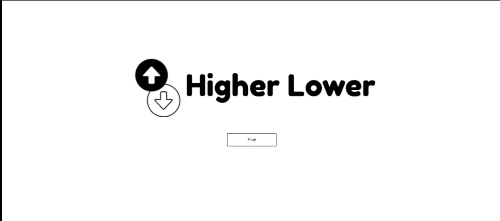
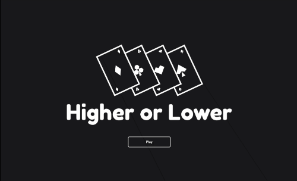
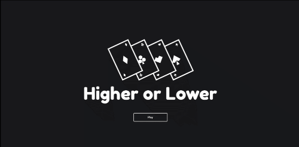
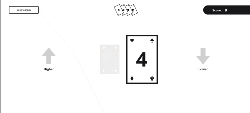

# 100DaysOfCode

### Welcome to my 100 Days of Code challenge! 💻

I've recently graduated from School of Code's part-time bootcamp and to prevent myself from slipping out of the habit/mindset of coding, I wanted to have a commitment that pushes me to keep progressing and developing my skills. Not only that, I want a way of measuring my improvements to make sure that I'm moving forward.

To complete the challenge, I'll be spending a minimum of 1 hour each day coding (*or learning a related technology/topic*), documenting my progress along the way through this repository. Let's see where these next 100 days take me!

# Progress

## Day 1: 3rd November 2021

The very first day of my 100 Days of code challenge! I wasn't sure where to start to be honest. I've got a list of topics and technologies to learn that's longer than my arms. In the end, I decided to ease into this challenge gently, recapping on a few topics that we'd covered during my time on the School of Code (SoC) bootcamp. So then. Day one. Here's what I did:

- Updated my LinkedIn profile, adding a little more about my journey into tech.
- Updated my GitHub profile, making sure my bio is decent(ish) and my projects are visible.
- Added more items to my mega list of things to learn 🤦🏻‍♂️.
- Began to refactor an old 'Higher or Lower' game that I'd built during my third week as an SoC Bootcamper. It was built in vanilla JS and I'd like to think the quality of my code has improved since then. I'll be recreating the game using React, which will give me a great excuse to revisit the various hooks that I don't fully understand.
- Fiddled around with some CSS transitions and keyframes for the Higher/Lower game's start page.

## Day 2: 4th November 2021

The second day was a long and (slightly) frustrating coding experience, but it was wrapped up nicely by heading over to the Brum.js event in Birmingham.

- Created a new logo and menu screen for the higher/lower game.

- Added a return button that exits the game and resets the scores.
- Got stuck on a piece of game logic not working for a good couple of hours, which led me to learning that useState is asynchronous.
- Watched a YouTube video on useState and useEffect. Still don't quite understand useEffect but I'll be diving more into that in the coming days.
- Went to Brum.js, met up with some of my fellow SoC bootcamp 6'ers and enjoyed a few great talks.

## Day 3: 5th November 2021

Day 3 has been a bit of a UX and CSS day. Made some more progress with the higher and lower game and it's really starting to come together now. So, my day:
- Drafted some low-fidelity wireframes of the higher/lower game's main UI
- Picked one I liked and coded it into the HTML/CSS

- Made a list of features for my MVP1 of the higher/lower game. Also drafted the MVP2 list of features - I haven't been using a Jira board for this so I might jump back onto that tomorrow and make it a habit.
- Spent some more time reading about useState and callback functions.

## Day 4: 6th November 2021
- Added higher and lower buttons to the game UI.
- One of the guys from the SoC bootcamp offered to help me with my state problem. After 90 mins of debugging and testing each line of code, it turned out that the problem was due to a function not being invoked properly. It was missing paranthesis whilst being called from another function (see below), which was somehow causing it to run twice? I'm not sure if I understand the problem properly but my state is fixed and that's a huge relief!

~~~~
// When higher button is clicked, this function is called. It checks if the next number is in fact higher and updates state based on that outcome.
  const handleHigher = () => {

    setPreviousNumber(currentNumber);
    setCurrentNumber(getRandomNumber()); ---> getRandomNumber was the problem. It was missing the '()'.
    
    if(previousNumber < currentNumber){
      setResult("win")
      setScore(score + 1);
    } else if (previousNumber === currentNumber){
      setResult("draw")
    } else {
      setResult("lose")
      setScore(0);
    }
  }
~~~~
- Realised that whilst 3 cards looked pretty in the UI, it was quite confusing to debug. I decided to remove a card.

## Day 5: 7th November 2021
Working on this game has made me aware that whilst I know how to build things in React (to a degree), there's a few gaps in my understanding of it. I decided to take a step back and take a React course, making sure that my fundamental knowledge and foundations are strong before I continue with the more complicated React projects.
- Started React course on YouTube by TheNetNinja, building along at the same time.
- Applied for a Front End Developer role advertised by SoC.

## Day 6: 8th November 2021
- Continued with React course by TheNetNinja. I learned:
  - That logical && evaluates the code to it's left first, before moving on to the right. In my code, if the left-sided code evaluates to falsy, my application doesn't render a HTML element.
  - How to add a .json data file to local files
  - How to apply useEffect to run async code and fetch requests
- I have a chat scheduled on Wednesday about a Junior UX Designer role. Worked on my portfolio some more in preparation, adding my final SoC project, Emission Impossible.
- Added state to higher/lower game which let's users know the result of that round.
